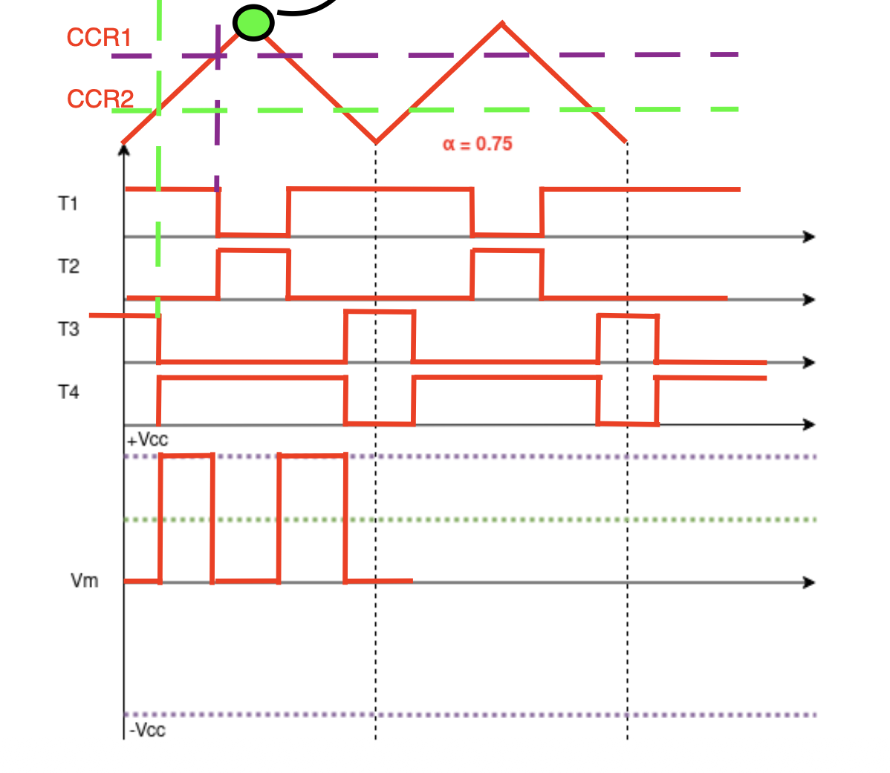
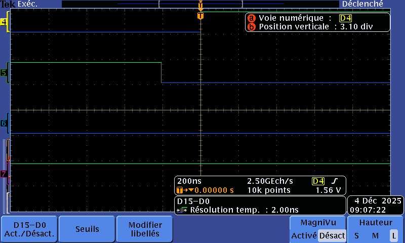
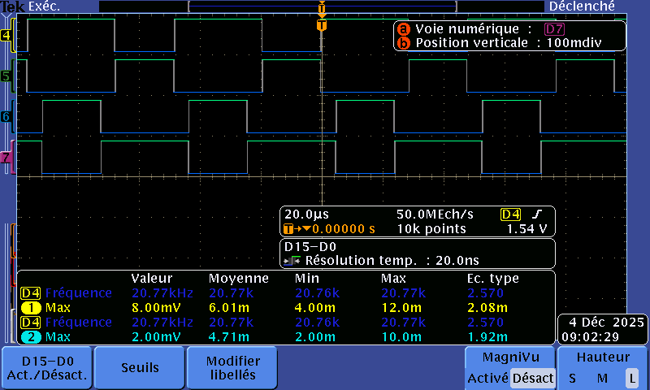

## 5. Shell

Jusqu'ici, nous prenons en main le shell et la strcuture globale du projet Cube IDE.
On le verra par la suite mais le shell va nous être très utile ! Notamment pour changer facilement la vitesse du moteur

## 6. Commande MCC basique 

### 6.1 Génération de 4 PWM

Cahier des charges :

Fréquence de la PWM : 20kHz

Temps mort minimum : à voir selon la datasheet des transistors

Résolution minimum : 10bits.

Notre nucléo STM32G474 peut être cadencé au maximum à 170MHz. On décide donc de travailler à cette fréquence et par conséquent on peut régler les paramètres de notre timer pour obtenir au moins 20kHz au borne du moteur avec une commande complémentaire décalée :

- En suivant la théorie, il faut que la commutation de nos MOSFET soit 2 fois supérieur à celle dans le moteur. De plus, on veut une précision d'au moins 10 bits. Par conséquent, on choisit PSC = 4 - 1 et ARR = 1024 - 1. On aura une fréquence de commutation MOSFET à 55 392Hz et du moteur à 27 696Hz > 20 000Hz.
<p align="center">
  
</p>

- Pour éviter de court-circuiter la carte, nous allons devoir imposer des deadtimes entre les commutations. D'après la datasheet des MOSFET (IRF540N),on relève un deadtime d'environ 170 ns ( reverse recovery time + rise/fall time).On prendra 200 ns donc sur l'IOC, 200/5,88( valeur datasheet)=34, on notera 34 dans le deadtime.
<p align="center">
  
</p>

Pour un rapport cyclique de 60 % il suffit de prendre 60% de l'ARR soit 614.


On peut alors tester tout cela avant de brancher le moteur :
<p align="center">
  
</p>

Le rapport cyclique est bien mis à 60%. On peut donc brancher le moteur et constaté que ça tourne correctement !

### 6.2. Commande de vitesse

Pour se faire, nous réaliser une fonction qui nous permet de changer facilement le PWM grâce au shell :

<div style="display: flex; gap: 40px;">

<div style="flex: 1;">
<pre>
<code class="language-c">
void Motor_SetDutyCycle(uint16_t ccr_value)
{
    // clamping
    if (ccr_value > MOTOR_CCR_MAX) {
        ccr_value = MOTOR_CCR_MAX;
    }

    __HAL_TIM_SET_COMPARE(&htim1, TIM_CHANNEL_1, ccr_value);
    __HAL_TIM_SET_COMPARE(&htim1, TIM_CHANNEL_2, MOTOR_CCR_MAX - ccr_value);
}
</code>
</pre>
</div>

<div style="flex: 1;">
<pre>
<code class="language-c">
static int sh_set_ccr(h_shell_t* h_shell, int argc, char** argv)
{
    // Vérification de l'argument
    if (argc < 2) {
        int size = snprintf(h_shell->print_buffer, SHELL_PRINT_BUFFER_SIZE,
                            "Erreur: Argument manquant. Usage: SETCCR <0-100>\\r\\n");
        h_shell->drv.transmit(h_shell->print_buffer, size);
        return -1;
    }

    int user_percent = atoi(argv[1]);

    if (user_percent < 0 || user_percent > 100) {
        int size = snprintf(h_shell->print_buffer, SHELL_PRINT_BUFFER_SIZE,
                            "Erreur: Valeur %d invalide. Entrez une valeur entre 0 et 100.\\r\\n",
                            user_percent);
        h_shell->drv.transmit(h_shell->print_buffer, size);
        return -1;
    }

    uint16_t ccr_register_value = (uint16_t)(((uint32_t)user_percent * MOTOR_CCR_MAX) / 100);

    Motor_SetDutyCycle(ccr_register_value);

    int size = snprintf(h_shell->print_buffer, SHELL_PRINT_BUFFER_SIZE,
                        "OK: Vitesse reglee a %d%% (Reg: %d/%d)\\r\\n",
                        user_percent, ccr_register_value, MOTOR_CCR_MAX);
    h_shell->drv.transmit(h_shell->print_buffer, size);

    return 0;
}
</code>
</pre>
</div>

</div>

### 6.3. Premiers tests

On réalise le test, d'abord à 50 % puis à 70 %. On constate un problème ! Lors du changement de vitesse, le courant augmente très rapidement et le moteur démarre de façon très sèche. 

Cela vient du fait que nous lui envoyons un échalon de tension "instantané" ce qui provoque la montée en flêche du courant et donc une mauvais démarrage. Pour remédier à cela, nous pouvons réaliser une fonction rample qui va permetre de faire monter doucement la tension donc la vitesse et donc le courant :
```C
void motor_ramp(uint16_t target_ccr)
{
    // Sécurisation de la valeur cible
    if (target_ccr > MOTOR_CCR_MAX) {
        target_ccr = MOTOR_CCR_MAX;
    }

    // Lecture de la valeur actuelle (approximation)
    uint16_t current_ccr = __HAL_TIM_GET_COMPARE(&htim1, TIM_CHANNEL_1);

    if (current_ccr < target_ccr)
    {
        // Rampe montée
        for (uint16_t ccr = current_ccr; ccr <= target_ccr; ccr += MOTOR_RAMP_STEP)
        {
            Motor_SetDutyCycle(ccr);
            HAL_Delay(MOTOR_RAMP_DELAY);
        }
    }
    else
    {
        // Rampe descente
        for (uint16_t ccr = current_ccr; ccr >= target_ccr; ccr -= MOTOR_RAMP_STEP)
        {
            Motor_SetDutyCycle(ccr);
            HAL_Delay(MOTOR_RAMP_DELAY);
            if (ccr < MOTOR_RAMP_STEP) break; // éviter underflow
        }
    }

    // Assurer que la valeur finale est exacte
    Motor_SetDutyCycle(target_ccr);
}
```

## 7. Commande en boucle ouverte, mesure de Vitesse et de courant

### 7.1. Commande de la vitesse
Nous avons rajouté Start et Stop qui peuvent être appelé depuis le Shell.


### 7.2. Mesure de courant

- Définir quel(s) courant(s) vous devez mesurer? Pour la mesure du courant, nous allons mesurer la courant total qui passe dans le moteur


- Définir les fonctions de transfert des capteurs de mesure de courant (lecture datasheet)? En regardant la datasheet / Kicad, on se rend compte les capteurs utilisés sont des 61-GO10-SME de chez LEM avec notamment un courant RMS de 10 A et on aura :
$I=\frac{V_{mesuré}-1.65}{0.05}$

- Déterminer les pin du stm32 utilisés pour faire ces mesures de courant ? D'après le kicad, la lecture du couant pour U sera sur PA1 , V sera sur PB2 et W sera sur PB13


Etablir une première mesure de courant avec les ADC en Pooling. Faites des tests à vitesse nulle, non nulle, et en charge (rajouter un couple resistif en consommant du courant sur la machine synchrone couplée à la MCC).

Avec un SETCCR=65%


Une fois cette mesure validée, modifier la méthode d'acquisition de ces données en établissant une mesure à interval de temps régulier avec la mise en place d'une la chaine d'acquisition Timer/ADC/DMA. 


Vous pouvez utiliser le même timer que celui de la génération des PWM pour que les mesures de courant soient synchrones aux PWM. Pour vérifier cela, utiliser un GPIO disponible sur la carte pour établir une impulsion lors de la mesure de la valeur.
### 7.3. Mesure de vitesse
Déterminons le PPR de notre encodeur. On relève sur l'encodeur 10V/1000 tr, on fait tourner notre moteur, on relève 13 V entre Vt+ et Vt- donc 1300 tr/min donc 21,6tr/s avec une fréquence sur notre pin PA6 = encodeur A, f=21,8 kHz et donc on a 1024 point/tr, on s'est placé en quadrature donc on multiplira par 4.

Déterminer la constant de temps mécanique du moteur :

3 tau = 260 ms donc tau = 87ms
Donc la fréquence est d'environ 10 Hz

Déterminer la fréquence à laquelle vous allez faire l'asservissement en vitesse du moteur :
On prendra donc 100 Hz, respectant Shannon.

Déterminer les pin du stm32 utilisées pour faire cette mesure de vitesse, sur le datasheet : 

Enc_A=PA6

Enc_B=PA4

Enc_Z=PC8
